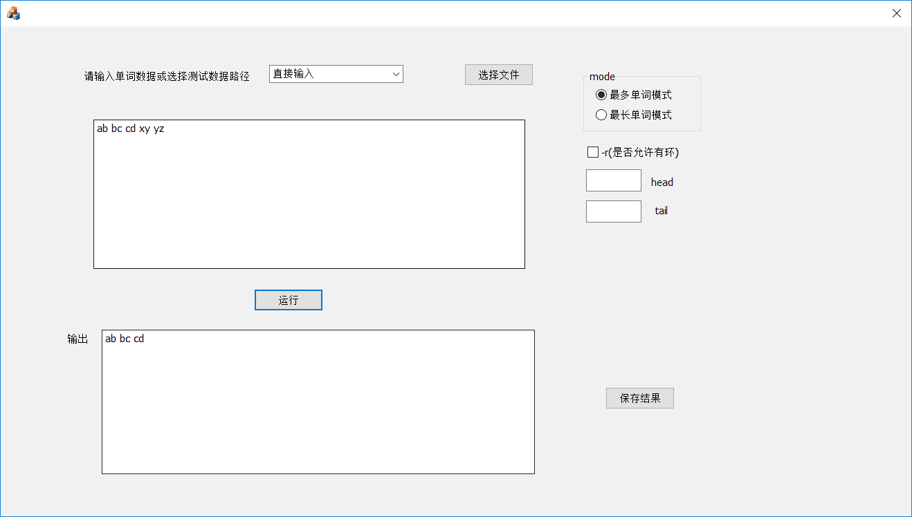

# max_word_chain-最长链生成
## 一、项目结构

##### brach:master

```
--BIN
	--Core.dll
	--Wordlist.exe
--GUIBIN
	--Core.dll
	--MFC_max_word_chain.exe
--mahaoxiang822/max_word_chain
	--Core
	--CoreUnitTest1
	--MFC_max_word_chain
	--max_word_chain
	--ClassDiagram.png
	--max_word_chain.sln
```

##### brach:dev-combine

该分支为交换测试分支，交换对象为***[赵智源、汪慕澜](https://github.com/supplient/longest_word_chain)***组。

## 二、安装说明

直接clone master分支即可

```
git clone https://github.com/mahaoxiang822/max_word_chain.git
```

## 三、运行说明

#### 1、windows控制台程序运行说明

命令行启动BIN目录下的Wordlist.exe。

启动参数说明

示例

```
wordlist.txt -w "in.txt" -h a -t x -r
```


| 参数 | 意义                               | 使用示例             |
| ---- | ---------------------------------- | -------------------- |
| -w   | 采用最多单词模式,后接输入文件路径  | -w "E:\wordlist.txt" |
| -c   | 采用最多字符模式，后接输入文件路径 | -c "E:\wordlist.txt" |
| -h   | 指定头字母,必须为小写a-z           | -h a                 |
| -t   | 指定尾字母,必须为小写a-z           | -t  f                |
| -r   | 如果输入文件有环不报错正常生成     | -r                   |

**注意：**

**（1）文件路径不得带有空格**

**（2）所有参数请严格按照规定，具体解释参照[作业原文](https://edu.cnblogs.com/campus/buaa/BUAA_SE_2019_LJ/homework/2638)。**

#### 2、GUI界面程序运行说明

GUIBIN目录下打开运行MFC_max_word_chain.exe即可



若选择直接输入请直接在输入框输入数据，否则选择文件输入，点击选择文件按钮来选择输入文件。

点击运行来获得结果，点击保存结果将结果保存到指定文件夹。
